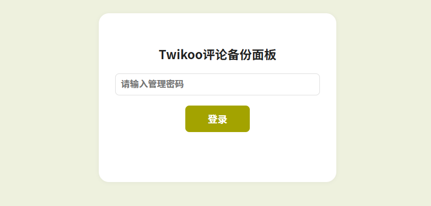
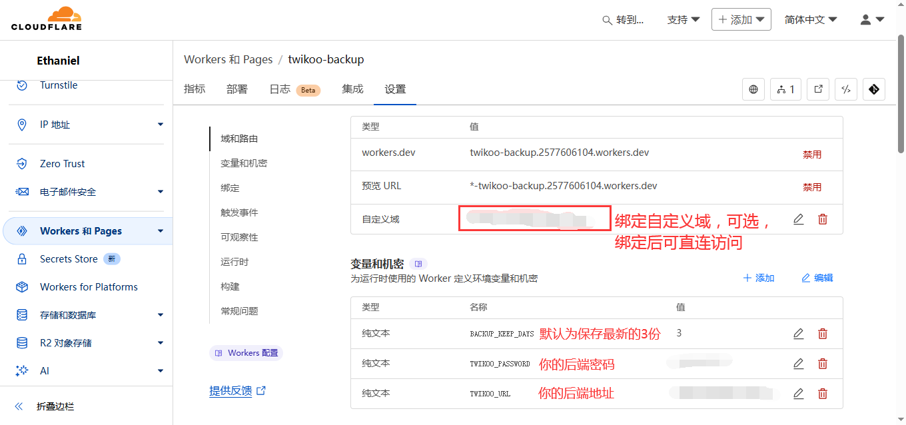

# Twikoo-backup




一键部署：

[](https://deploy.workers.cloudflare.com/?url=https://github.com/2010HCY/twikoo-backup)

Twikoo评论数据备份，使用CloudflareWorkers工作流实现自动备份，也可以手动备份，备份数据储存在D1数据库。备份将在每天00：00自动运行。

页面有密码保护，防止数据泄露、大量备份请求。

若Twikoo评论数据出现丢失、恶意污染，你可以在浏览器里一键下载最新备份，下载文件名为`twikoo-comment-备份日期.json`


部署很简单，点击一键部署按钮，然后根据提示设置数据库名，部署好后到Workers的设置里设置下变量，

变量说明

```
TWIKOO_URL = "https://xxxxx/.netlify/functions/twikoo" #你的Twikoo后端地址
TWIKOO_PASSWORD = "xxxxx"  #你的Twikoo后端密码
BACKUP_KEEP_DAYS = "3" #工作流将保存几份备份
ADMIN_PASSWORD = "admin12345678" #你的访问密码
COOKIE_EXPIRES_DAYS = "0" #cookie过期时间
```

然后打开Workers页面，点击开始备份或等待次日00：00自动备份，若下方出现了历史备份就说明成功了



## 更新日志

2025-05-27 18:15:45 添加密码保护，保护数据、后端安全

2025-04-21 11:16:25 横空出世，具有自动备份、手动备份、下载备份等基础功能
