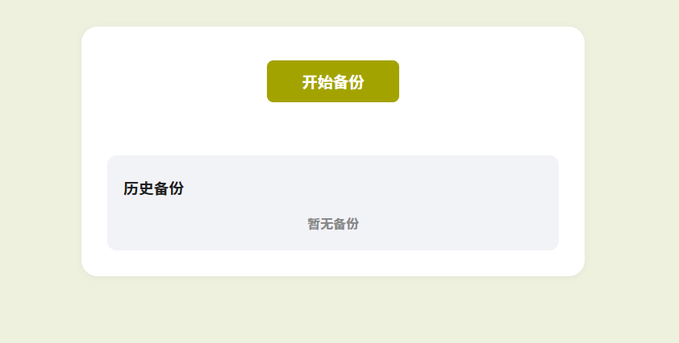
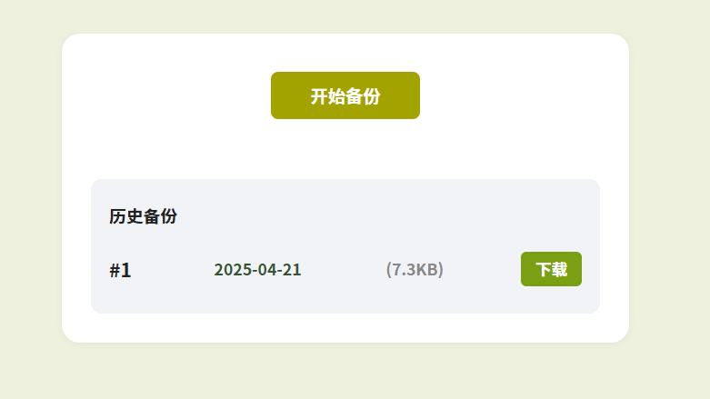

# Twikoo-backup



一键部署：

[](https://deploy.workers.cloudflare.com/?url=https://github.com/2010HCY/twikoo-backup)

Twikoo评论数据备份，使用CloudflareWorkers工作流实现自动备份，也可以手动备份，备份数据储存在D1数据库。备份将在每天00：00自动运行。

若Twikoo评论数据出现丢失、恶意污染，你可以在浏览器里一键下载最新备份，下载文件名为`twikoo-comment-备份日期.json`



部署很简单，点击一键部署按钮，然后根据提示设置数据库名，部署好后到Workers的设置里设置下变量，

变量说明

```
TWIKOO_URL = "https://xxxxx/.netlify/functions/twikoo" #你的Twikoo后端地址
TWIKOO_PASSWORD = "xxxxx"  #你的Twikoo后端密码
BACKUP_KEEP = "3" #工作流将保存几份备份
```

然后打开Workers页面，点击开始备份或等待次日00：00自动备份，若下方出现了历史备份就说明成功了


